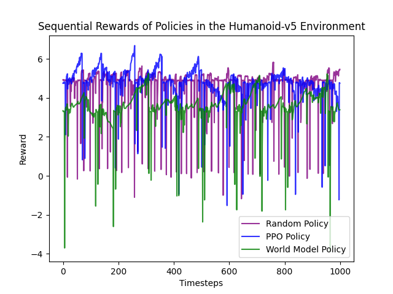
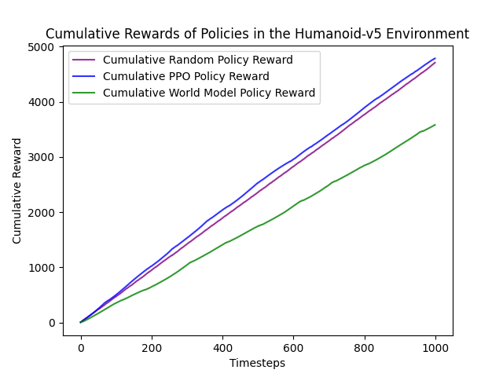

# Dreaming Up Human Physics
*Sean Steinle, Kiya Aminfar*

This repository contains the final project for the George Mason course CS757, Deep Generative Models.

## How To Run and Directory Breakdown

There are two ways to run our code. If you're more interested in seeing the general concepts we explore, check out `notebooks/`. If you'd like to replicate our models at scale, check out `scripts/`. Specifically for `scripts/`, you should run the scripts in order of `gather_experiences.py`, then `train_vae.py`, then `train_mdnrnn.py`, and finally `train_controller.py`. Note that you'll likely need to set parameters at the bottom of each file before you run. Also note that training world models can be quite computationally expensive, especially the MDN-RNN and the controller.

This repository was tested with a lightweight Windows 10 machine and Python 3.10. Please note that the MuJoCo library may require vastly different subdependencies based on operating system. Accordingly, we recommend installing our core dependencies by hand rather than via the `requirements.txt` provided. To get started, in your Python 3.10 virtual environment run: `pip install gymnasium gymnasium[mujoco] numpy tensorflow`.

## Introduction

Welcome to the world of world models! This project investigates how world models can be used to train agents to solve physical motion problems from the [MuJoCo environment](https://www.gymlibrary.dev/environments/mujoco/index.html).

World models were first presented in [World Models (2018)](https://worldmodels.github.io/). This paper presented a path for leveraging generative models to produce better sequential decision making agents. Specifically, the intuition was that by having agents learn a generative model of the environment, they are gathering broadly useful information about their task which will improve their policy. Unfortunately, the paper is quite old at this point and even the [modernization effort for the paper's experiments](https://github.com/zacwellmer/WorldModels) is deprecated. Even if it weren't deprecated, the implementation is somewhat complex and difficult for a beginner to approach. Thus, our goal for this project is to reimplement the paper's approach from scratch, with a minimalistic style, on an entirely new environment!

What new environment you ask? MuJoCo, or Multi-Joint dynamics with Contact. MuJoCo is a physics-minded library which offers a number of different tasks that involve optimizing movement. Many of the tasks are trivial, with small action and observation spaces. However, some of the more complex tasks can become very computationally expensive to solve since they require optimizing action spaces and observation spaces with hundreds of dimensions. One of these tasks is [Humanoid](https://www.gymlibrary.dev/environments/mujoco/humanoid/), where the goal is to train a human-shaped object to walk by learning a policy in a 17-dimensional action space!

This project accomplishes this goal by training a world model. We find that the world model approach outperforms a random policy or even the classic PPO algorithm. We also show lots of interesting qualitative examples of *how* the world model learns to understand basic physics. 

## Approach

Before diving into our approach, it's worth reviewing the basic architecture of the original world models implementation. There are three core components:

1. A Variational Autoencoder (VAE) which learns a latent representation of the observation space. This is roughly analogous to the heuristics humans use to solve problems like looking at the curvature of a road when driving.
2. A Mixture Density Network - Recurrent Neural Network (MDN-RNN) which models the dynamics of the environment. This is similar to human agents' ability to 'think ahead' and visualize the various ways a state may develop.
3. An evolutionary controller which chooses the optimal actions given information from the VAE and MDN-RNN. This is the actual 'decision-maker'.

Our contributions are simple: we implemented and trained each of the core components to be compatible with the Humanoid-v5 task in MuJoCo. This required reviewing the objective functions and architectures of each of the components, reviewing the original implementation, and a lot of prompting ChatGPT. We ended up with a single notebook which steps through the entire process (`notebooks/world_model_core.ipynb`) as well as a collection of four sequential scripts (`scripts/gather_experiences.py`, `scripts/train_vae.py`, `scripts/train_mdnrnn.py`, and `scripts/train_controller.py`) which allow for scaling the approach. We then ran the scripts on George Mason's high-performance computing (HPC) cluster, Hopper, to retrieve our final results.

That all said, there was a lot we didn't get to implement. First, and foremost, we didn't implement in-dream training. This is one of the core promises of world models--that training agents can be done entirely within their own generative model of the environment. Likewise, the evolutionary controller could use a better candidate generation algorithm (like CMA-ES) -- we simply use random selection. We would have also liked to explore our performance on similar tasks within the MuJoCo environment, especially given that our models were all implemented with flexible dimensionality for new action spaces and tasks. Finally, we'd have preferred to have a better exploration of the *many* hyperparameters of our world models like the dimensionality of `z`, the learning rate and training time of each component, or even component-specific hyperparameters like the elite-rate of our evolutionary algorithm.

Why didn't we have the time? It's actually quite simple:
1. *World models are complex*. Even our 'minimalist' version was 500+ lines of pure script!
2. *World models are computationally expensive*. World models aren't foundation models, but they are sort of 'omni-models' of an environment, which requires a ton of compute (specifically the MDN-RNN). Furthermore, our access to compute was limited because this was a school project and the school cluster's GPUs are in serious demand.

## Results

To evaluate world models, we ran two experiments. First, we ran a small experiment via a Jupyter Notebook to verify that our architecture worked. Then we ran a larger experiment via Python scripts and the Hopper cluster to get a higher performant model. We compare these runs with a random policy and a PPO policy from StableBaselines3.

### Small Run (Notebook Version)

Our first run was on about 400 episodes (10,000 timesteps) of data. We trained the VAE for 20 epochs, the MDN-RNN for 10 epochs, and the controller for 10 epochs. We used a dimensionality of 32 for `z`. This allowed us to train each component in under a half hour, however the performance of the model was abysmal. In fact, a random policy did much better than our model. 

On the bright side, we were able to reconstruct scenes based on our VAE's encodings, which was very interesting and illustrative. Additionally, this short run provides a 'sanity check' for users to test our implementation and their environment interactively.

### Larger Run (Script Version)

Our second run was on about 10,000 episodes (250,000 timesteps) of data. We trained the VAE for 25 epochs, the MDN-RNN for 25 epochs, and the controller for 100 epochs. We used a dimensionality of 32 for `z`. This took significantly more time (about 6-8 hours total), especially because Hopper did not offer us GPU access even over the span of several days. The VAE and controller were both fairly quick to train, but each epoch of the MDN-RNN took quite a lot of compute (~15 minutes on our setup).

Unfortunately, this run did not produce a broadly successful policy. The average reward of the random and PPO policies were about 4.7 per step whereas the world model was only 3.5 per step. Obviously sub-random performance is poor, but given that the PPO policy only performs equal to the random policy shows just how computationally expensive this problem is to solve -- it's clear we didn't train the PPO long enough and we let it train for over an hour.

Despite its poor overall performance, there is some reason for optimism with the world model. Whereas the random policy doesn't seem to have any sustained momentum in gathering reward over sequences of timesteps, both the world model and PPO policies do. Additionally, even thoguh the world model policy has a 'resting reward' that is subrandom, when it gets onto a learning trajectory it matches the performance of PPO. We interpret this as evidence of the fragility of world models: the architecture contains a powerful design, but large amounts of training are needed to align the disparate components.

### Visualization

Although we weren't able to implement in-dream training, we did take a stab at rendering 'dreams' from the world model. This required back-transforming the latent space for a slice of our collect observations, then forcing the MuJoCo environment to render them. Unfortunately, we found that MuJoCo cannot directly render observations well -- instead, MuJoCo applies some black box of transformations to create a renderable 'state'. Attempting to render observations directly results in an incredibly unstable visualization, but we tried anyway! In the `doc/videos/` directory you can find a video which was rendered from true state (`true_state.mp4`), a video which was rendered from true observations (`true_obs.mp4`), and a video which was rendered from sampled and back-transformed latent observations (`reconstr_obs.mp4`). If you squint, you can tell that there is loss between the latter two videos, and that the 'dream' is more sporadic than the original observations.

## Conclusion

World models are an innovative technique that integrates the power of generative models to unlock more broadly understanding agents. Unfortunately, we found that the complex nature of world model design can be a huge inhibitor to training successful models, primarily due to the computational cost of training the MDN-RNN. However, this work showed the promise of world models to improve on classical RL techniques in physics-based tasks like those of the MuJoCo environment.

